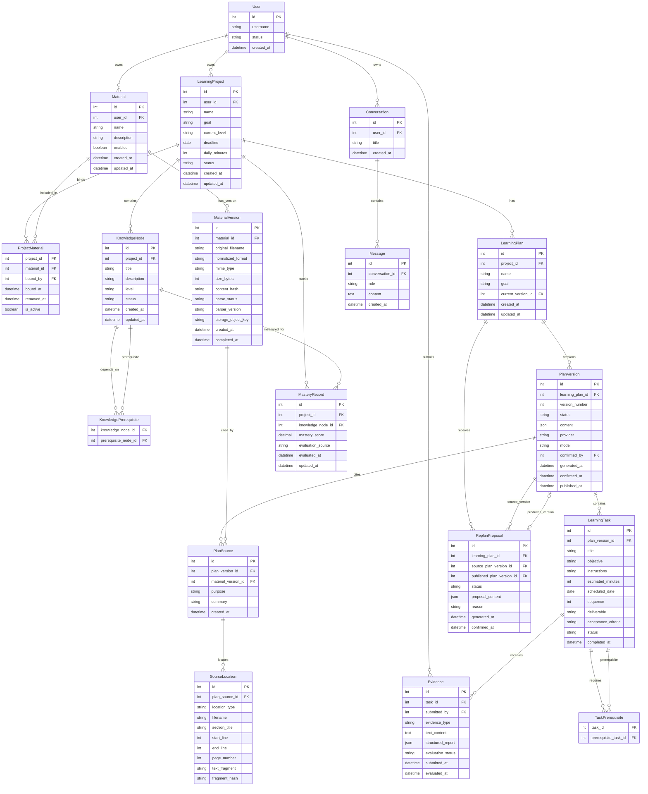

# 学习平台领域模型

> 状态：Day122 已冻结  
> 决策日期：2026-08-21  
> 适用范围：Day121-Day145 学习平台最小纵向闭环  
> 当前 MVP：真实资料驱动的学习项目、计划、任务和证据闭环

## 1. 领域目标

本阶段围绕以下核心闭环设计领域模型：

```text
用户注册并登录
-> 创建学习项目
-> 上传 Markdown、TXT 或文本型 PDF
-> 资料解析并达到 READY
-> 基于 READY 资料生成计划草案
-> 用户确认并发布计划
-> 查看和执行学习任务
-> 提交学习证据
-> 更新任务状态和掌握度
-> 必要时生成计划重排提案
-> 用户确认后发布新的计划版本
```

正式学习计划必须来自当前用户提供并成功解析为 `READY` 的真实资料。

模型可以生成计划草案和调整建议，但不能绕过用户确认直接发布正式计划，也不能直接修改正式任务状态。

## 2. 当前 MVP 范围

第一版资料格式只支持：

| 规范化格式 | 说明 |
| --- | --- |
| `markdown` | Markdown 文档，保留标题、章节和代码块 |
| `txt` | 纯文本文件，保留行号或文本偏移 |
| `text_pdf` | 具有文本层的 PDF，保留页码和文本定位 |

第一版不支持：

- 扫描型 PDF；
- OCR；
- DOCX；
- PPTX；
- 网页 URL；
- Git 仓库；
- 自动联网搜索；
- 平台模板市场；
- 无资料生成正式计划；
- 向量检索；
- Reranker；
- Agent 自动规划；
- 多用户协作；
- 组织权限；
- SSO；
- Refresh Token。

上述能力不是永久取消，而是当前 MVP 不提前实现。

## 3. 核心实体

本阶段涉及以下实体：

```text
User
LearningProject
Material
MaterialVersion
ProjectMaterial
KnowledgeNode
KnowledgePrerequisite
LearningPlan
PlanVersion
PlanSource
SourceLocation
LearningTask
TaskPrerequisite
Evidence
MasteryRecord
ReplanProposal
Conversation
Message
```

### 3.1 User

`User` 使用现有 `users` 表。

用户是所有学习领域资源的最终所有者。

现有用户实体已经包含：

- `id`
- `username`
- `password_hash`
- `status`
- `created_at`

未来学习领域资源必须通过直接或间接关系回溯到 `User`。

```text
User 1 --- N LearningProject
User 1 --- N Material
User 1 --- N Evidence
User 1 --- N Conversation
```

### 3.2 LearningProject

`LearningProject` 表示用户正在进行的一个学习项目。

一个用户可以创建多个学习项目，一个学习项目只能属于一个用户。

至少需要表达：

- `id`
- `user_id`
- 项目名称
- 学习目标
- 当前基础
- 截止日期
- 每日可用学习分钟数
- 每周可学习天数
- 期望成果
- 项目状态
- 创建时间
- 更新时间

项目状态候选值：

```text
DRAFT
ACTIVE
PAUSED
COMPLETED
ARCHIVED
```

项目必须始终属于一个用户，不能创建没有所有者的项目。

### 3.3 Material

`Material` 表示用户可以识别的逻辑资料。

它不是一次具体上传文件，而是一个资料集合或资料名称。

例如：

```text
FastAPI 官方文档学习资料
Python 数据库课程资料
我的 PostgreSQL 学习笔记
```

`Material` 至少需要表达：

- `id`
- `user_id`
- 资料名称
- 资料描述
- 当前是否启用
- 创建时间
- 更新时间

一个逻辑资料可以拥有多个资料版本。

```text
Material 1 --- N MaterialVersion
```

### 3.4 MaterialVersion

`MaterialVersion` 表示某一次真实文件上传和解析产生的不可变资料版本。

原始文件和解析结果都属于资料版本。

至少需要表达：

- `id`
- `material_id`
- 原始文件名
- 文件扩展名
- 规范化格式
- MIME 类型
- 文件大小
- 内容哈希
- 存储对象标识
- 解析器名称
- 解析器版本
- 解析状态
- 解析后的内容摘要
- 解析后的内容存储位置
- 失败业务错误码
- 失败原因
- 创建时间
- 处理完成时间

规范化格式：

```text
markdown
txt
text_pdf
```

资料版本处理状态：

```text
UPLOADED
QUEUED
PARSING
READY
FAILED
```

状态含义：

| 状态 | 含义 |
| --- | --- |
| `UPLOADED` | 文件已通过基础上传检查 |
| `QUEUED` | 解析任务已进入后台队列 |
| `PARSING` | 解析器正在处理 |
| `READY` | 解析成功、内容非空、来源定位可用 |
| `FAILED` | 格式不支持、内容为空、解析失败或不满足安全边界 |

只有 `READY` 资料版本可以进入正式计划生成。

`UPLOADED` 不等同于 `READY`。

`FAILED` 不得被当作 `READY` 使用。

### 3.5 ProjectMaterial

`ProjectMaterial` 是学习项目和逻辑资料之间的绑定实体。

项目和资料采用多对多关系：

```text
LearningProject N --- N Material
```

通过 `ProjectMaterial` 实现。

使用独立绑定实体的原因：

- 同一资料可以服务多个学习项目；
- 一个项目可以绑定多个资料；
- 可以明确加入和移除资料；
- 可以实现重复绑定幂等；
- 可以保存绑定时间；
- 可以保存移除时间；
- 可以保护历史计划中的资料来源；
- 不需要把资料永久固定在某一个项目上。

至少需要表达：

- `project_id`
- `material_id`
- 绑定用户
- 绑定时间
- 移除时间
- 当前是否有效
- 创建时间
- 更新时间

业务规则：

1. 只有当前用户拥有的项目和资料才能建立绑定；
2. 同一项目不能重复创建同一逻辑资料的有效绑定；
3. 移除绑定不会删除历史资料版本；
4. 移除绑定不会破坏已经发布计划的来源证明；
5. 历史计划仍然可以引用之前使用过的资料版本；
6. 当前项目资料列表不显示已移除的绑定。

### 3.6 KnowledgeNode

`KnowledgeNode` 表示某个学习项目中的知识点。

知识点不是平台通用知识库中的永久概念，而是当前用户项目中的学习对象。

至少需要表达：

- `id`
- `project_id`
- 知识点标题
- 知识点描述
- 难度或层级
- 当前状态
- 创建时间
- 更新时间

知识点必须属于一个学习项目。

知识点可以通过来源关系指向一个或多个 `MaterialVersion`。

### 3.7 KnowledgePrerequisite

`KnowledgePrerequisite` 表示知识点之间的前置关系。

```text
KnowledgeNode N --- N KnowledgeNode
```

通过 `KnowledgePrerequisite` 实现。

例如：

```text
Python 基础 -> FastAPI
HTTP 基础 -> REST API
SQL 基础 -> SQLAlchemy
```

业务规则：

- 前置关系必须属于同一个学习项目；
- 前置关系是有向关系；
- 不能形成循环依赖；
- 不允许知识点把自己设置为自己的前置知识点；
- Day122 只冻结领域规则；
- Day132 再决定应用层检查或数据库事务检查方式。

### 3.8 LearningPlan

`LearningPlan` 表示某个学习项目的一组计划版本。

一个学习项目可以拥有多个逻辑计划。

例如：

```text
第一阶段后端学习计划
FastAPI 八周学习计划
数据库专项学习计划
```

至少需要表��：

- `id`
- `project_id`
- 计划名称
- 计划目标
- 当前正式版本 ID
- 创建时间
- 更新时间

`LearningPlan` 是稳定的逻辑计划，不直接保存全部计划任务。

计划具体内容保存在 `PlanVersion`。

```text
LearningProject 1 --- N LearningPlan
LearningPlan 1 --- N PlanVersion
```

### 3.9 PlanVersion

`PlanVersion` 表示一次计划生成结果。

它可以是计划草案，也可以是已经发布的正式版本。

至少需要表达：

- `id`
- `learning_plan_id`
- 版本号
- 版本状态
- 结构化计划内容
- 计划目标
- 生成时间
- Provider 标识
- 模型标识
- 生成请求标识
- 用户确认时间
- 确认用户 ID
- 发布时间
- 失败原因
- 拒绝原因
- 创建时间

计划版本状态：

```text
DRAFT
PUBLISHED
REJECTED
FAILED
ARCHIVED
```

最小发布流程：

```text
生成计划
-> 保存为 DRAFT
-> 用户查看草案
-> 用户确认并发布
-> 转换为 PUBLISHED
```

业务规则：

1. 模型只能创建 `DRAFT`；
2. `DRAFT` 必须经过用户明确确认；
3. 用户确认后才能转换为 `PUBLISHED`；
4. `PUBLISHED` 不能被原地覆盖；
5. 新资料只能生成新的草案或新的计划版本；
6. 生成失败时，旧的正式版本继续有效；
7. 用户拒绝草案时，旧的正式版本继续有效；
8. 同一个逻辑计划最多只有一个当前生效的正式版本；
9. 新版本发布后，正式任务来自新版本；
10. 已发布版本的资料来源不能被新资料静默替换。

用户确认不是复杂审批系统。

第一版只保留一次明确的：

```text
确认并发布
```

不实现：

- 逐条审批；
- 多人审批；
- 审批人列表；
- 复杂编辑器；
- 组织级审批流。

### 3.10 PlanSource

`PlanSource` 表示某个计划版本实际使用了哪些资料版本。

计划版本不能只保存模型生成的一段自由文本引用。

```text
PlanVersion N --- N MaterialVersion
```

通过 `PlanSource` 建立关系。

至少需要表达：

- `plan_version_id`
- `material_version_id`
- 来源用途
- 引用摘要
- 来源创建时间

`PlanSource` 必须指向真实存在的 `MaterialVersion`。

业务规则：

- 资料版本必须属于当前用户；
- 资料版本必须属于当前项目已绑定或历史绑定的资料；
- 计划版本必须属于当前用户的学习项目；
- 不能把其他用户资料版本绑定到当前用户计划；
- 不能根据模型输出虚构资料 ID；
- 不能根据模型输出虚构文件名、章节、页码或行号。

### 3.11 SourceLocation

`SourceLocation` 表示计划或任务引用资料的真实定位。

它至少需要表达：

- `plan_source_id`
- 定位类型
- 文件名
- Markdown 标题或章节
- TXT 起始行号
- TXT 结束行号
- 文本起始偏移
- 文本结束偏移
- PDF 页码
- 文本片段
- 文本片段哈希

定位类型候选值：

```text
MARKDOWN_SECTION
TXT_LINES
TEXT_OFFSET
PDF_PAGE
PDF_TEXT_RANGE
```

不同格式使用不同定位字段：

| 格式 | 主要定位 |
| --- | --- |
| Markdown | 标题、章节、代码块 |
| TXT | 起止行号、文本偏移 |
| 文本型 PDF | 页码、文本片段 |

来源定位必须指向真实资料内容。

### 3.12 LearningTask

`LearningTask` 表示计划版本中的一个可执行学习任务。

任务必须属于具体的 `PlanVersion`，不能只属于项目。

```text
PlanVersion 1 --- N LearningTask
```

至少需要表达：

- `id`
- `plan_version_id`
- 任务标题
- 学习目标
- 任务说明
- 任务步骤
- 预计学习分钟数
- 计划日期
- 计划顺序
- 产出要求
- 验收标准
- 当前状态
- 完成时间
- 创建时间
- 更新时间

任务状态候选值：

```text
DRAFT
READY
IN_PROGRESS
SUBMITTED
PASSED
REVISION_REQUIRED
SKIPPED
```

正式任务只能来自 `PUBLISHED` 的计划版本。

任务状态不能被模型直接修改。

任务状态必须由后端业务规则、证据评价结果和用户操作共同决定。

### 3.13 TaskPrerequisite

`TaskPrerequisite` 表示任务之间的前置关系。

```text
LearningTask N --- N LearningTask
```

通过 `TaskPrerequisite` 实现。

业务规则：

- 前置任务和当前任务必须属于同一个 `PlanVersion`；
- 任务不能设置自己为自己的前置任务；
- 前置关系不能形成循环；
- 未满足前置条件的任务不能直接进入可执行状态；
- 新计划版本不直接复用旧版本的任务关系；
- 新版本必须保存自己的任务和前置关系快照。

### 3.14 Evidence

`Evidence` 表示用户针对学习任务提交的学习证据。

证据不是任务状态本身。

```text
LearningTask 1 --- N Evidence
User 1 --- N Evidence
```

第一版支持：

```text
TEXT_ANSWER
STRUCTURED_TEST_REPORT
```

至少需要表达：

- `id`
- `task_id`
- `submitted_by`
- 证据类型
- 文本内容或受控存储引用
- 结构化报告内容
- 提交时间
- 规则评价结果
- 模型辅助评价结果
- 最终评价状态
- 评价时间

证据状态候选值：

```text
SUBMITTED
ACCEPTED
REJECTED
NEEDS_REVISION
```

业务规则：

1. 证据必须属于当前用户可以访问的任务；
2. 提交用户必须与任务所属项目用户一致；
3. 不能只验证 `task_id` 是否存在；
4. 规则评价和模型评价需要分开保存；
5. 模型只能提供建议；
6. 模型不能绕过业务规则直接把任务改为 `PASSED`；
7. 任务最终状态由后端确定性规则决定。

### 3.15 MasteryRecord

`MasteryRecord` 表示用户在某个学习项目中对某个知识点的当前掌握度快照。

掌握度不等同于某一次证据提交。

```text
LearningProject 1 --- N MasteryRecord
KnowledgeNode 1 --- N MasteryRecord
```

至少需要表达：

- `id`
- `project_id`
- `knowledge_node_id`
- 当前掌握度
- 掌握度等级
- 评估来源
- 最近评估时间
- 更新时间

掌握度评估来源候选值：

```text
SELF_REPORT
RULE_EVALUATION
MODEL_ASSISTED
MANUAL_REVIEW
```

第一版只保留当前快照。

复杂的掌握度历史、遗忘曲线和复习事件在后续阶段增加。

如果需要保存历史，必须采用追加记录或单独历史表，不能覆盖已经发生的评估事实。

### 3.16 ReplanProposal

`ReplanProposal` 表示系统根据资料、任务证据、掌握度或实际耗时生成的计划调整建议。

它是建议，不是正式计划。

```text
LearningPlan 1 --- N ReplanProposal
PlanVersion 1 --- N ReplanProposal
```

至少需要表达：

- `id`
- `learning_plan_id`
- 来源计划版本 ID
- 建议内容
- 调整原因
- 受影响任务
- 提案状态
- 生成时间
- 用户确认时间
- 确认用户 ID
- 发布后产生的新计划版本 ID

提案状态候选值：

```text
DRAFT
PENDING_CONFIRMATION
ACCEPTED
REJECTED
PUBLISHED
FAILED
```

业务规则：

1. 提案不能直接修改已发布计划；
2. 提案不能直接修改正式任务状态；
3. 用户确认后才能发布新的计划版本；
4. 用户拒绝后，当前正式计划继续有效；
5. 新版本必须保留新资料版本和来源定位；
6. 计划重排必须保留变更原因和版本差异。

### 3.17 Conversation 和 Message

现有聊天实体继续作为独立的用户聊天资源。

```text
User 1 --- N Conversation
Conversation 1 --- N Message
```

`Conversation` 至少表达：

- `id`
- `user_id`
- 标题
- 创建时间

`Message` 至少表达：

- `id`
- `conversation_id`
- 角色
- 消息内容
- 创建时间

Day122 不把聊天强行绑定到学习项目。

未来可以增加可选上下文：

- `project_id`
- `plan_version_id`
- `task_id`

但这些字段在当前 MVP 不作为必填外键。

原因：

- 当前聊天网关已经存在；
- 当前聊天必须继��支持普通 JWT 用户对话；
- 学习项目模型尚未完全实现；
- 强行增加必填关系会提前耦合未完成的领域实体；
- 聊天上下文关系应在真实需求出现后单独设计。

## 4. Mermaid ER 图



## 5. 所有权边界

所有学习资源都必须能够回溯到当前 JWT 用户。

路由参数中的资源 ID 不能单独作为授权依据。

| 资源 | 所有权判断 |
| --- | --- |
| LearningProject | `project.user_id == current_user.id` |
| Material | `material.user_id == current_user.id` |
| MaterialVersion | 通过 `material.user_id` 判断 |
| ProjectMaterial | 同时验证项目和资料属于当前用户 |
| KnowledgeNode | 通过 `project.user_id` 判断 |
| KnowledgePrerequisite | 两个知识点必须属于同一用户项目 |
| LearningPlan | 通过 `project.user_id` 判断 |
| PlanVersion | 通过计划所属项目判断 |
| PlanSource | 同时验证计划和资料版本属于当前用户及当前项目 |
| SourceLocation | 通过 `plan_source` 回溯到当前用户 |
| LearningTask | 通过计划版本和项目判断 |
| TaskPrerequisite | 两个任务必须属于同一个计划版本 |
| Evidence | 通过任务、计划版本和项目判断，并验证提交用户 |
| MasteryRecord | 通过项目判断，并验证知识点属于同一项目 |
| ReplanProposal | 通过逻辑计划和项目判断 |
| Conversation | `conversation.user_id == current_user.id` |
| Message | 通过 `conversation.user_id` 判断 |

### 5.1 必须拒绝的访问方式

后端不得：

- 只按资源 ID 查询后直接返回；
- 先查询资源，再使用不一致的项目 ID 判断；
- 允许用户把其他用户资料绑定到自己的项目；
- 允许计划来源指向其他用户资料版本；
- 允许用户通过猜测 ID 访问其他用户任务；
- 允许用户提交其他用户项目的证据；
- 允许 API Key 替代 JWT 访问学习资源；
- 允许模型输出直接改变正式任务状态；
- 允许前端传入的 `user_id` 覆盖当前 JWT 用户。

### 5.2 推荐查询原则

项目资源推荐使用带所有权条件的查询：

```text
SELECT resource
FROM resource
JOIN project ON resource.project_id = project.id
WHERE resource.id = :resource_id
  AND project.user_id = :current_user_id
```

后续实现时，repository 或 service 层必须确保当前用户 ID 参与查询，而不是由路由层查询完成后再补判断。

## 6. 资料状态规则

资料版本状态：

```text
UPLOADED -> QUEUED -> PARSING -> READY
                               -> FAILED
```

允许的业务过程：

```text
上传成功
-> 基础检查通过
-> 加入解析队列
-> 开始解析
-> 解析成功并确认内容非空
-> READY
```

失败情况包括：

- 文件格式不支持；
- 文件扩展名和 MIME 不一致；
- 文件内容为空；
- PDF 没有文本层；
- PDF 损坏；
- 解析器异常；
- 内容无法满足安全边界；
- 来源定位无法生成。

扫描型 PDF 不得因为扩展名为 `.pdf` 就进入 `READY`。

只有同时满足以下条件，资料版本才能进入 `READY`：

1. 资料属于当前用户；
2. 资料格式属于 `markdown`、`txt` 或 `text_pdf`；
3. 文件通过大小和安全检查；
4. 解析过程成功；
5. 解析后的内容非空；
6. 来源定位信息可用；
7. 解析结果和内容哈希已经保存。

## 7. 计划版本规则

正式计划版本必须满足：

1. 所属项目属于当前 JWT 用户；
2. 至少关联一个属于当前项目的 `READY` 资料版本；
3. 计划内容已经生成并通过结构校验；
4. 计划来源包含真实资料版本；
5. 计划来源包含真实章节、行号或页码定位；
6. 当前版本状态为 `DRAFT`；
7. 用户完成明确确认；
8. 后端事务将版本转换为 `PUBLISHED`。

发布后的版本：

- 不允许原地覆盖；
- 不允许修改资料来源；
- 不允许被新资料静默替换；
- 不允许被模型直接删除；
- 不允许被新草案自动替代；
- 可以作为历史版本继续查询；
- 可以通过新版本进行后续调整。

新资料到达后：

```text
新资料解析
-> 判断是否影响当前计划
-> 生成新的计划草案
-> 保存新资料版本引用
-> 用户查看差异
-> 用户确认
-> 发布新计划版本
```

如果新草案失败或被拒绝，旧的 `PUBLISHED` 版本继续有效。

## 8. 证据和任务状态规则

证据是用户提交的事实。

任务状态是后端根据规则得出的业务状态。

两者不能混为一谈。

```text
用户提交证据
-> 保存 Evidence
-> 执行格式检查
-> 执行确定性规则
-> 可选执行模型辅助评价
-> 生成评价结果
-> 后端决定任务状态
```

模型评价只能作为辅助信息保存：

```text
规则结果
模型建议
最终业务状态
```

三者应当分开记录。

模型不能直接执行：

```text
task.status = PASSED
```

任务状态必须经过后端服务层和必要的事务处理。

## 9. 掌握度规则

第一版的 `MasteryRecord` 是当前掌握度快照。

掌握度可以来自：

- 用户自评；
- 规则评价；
- 模型辅助评价；
- 人工复核。

掌握度不能覆盖历史事实。

如果后续需要掌握度历史，应增加追加型记录：

```text
MasteryEvent
-> 记录一次评估
-> 更新 MasteryRecord 当前快照
```

当前 Day122 不创建 `MasteryEvent`。

## 10. 重排提案规则

重排提案必须保存：

- 原计划版本；
- 触发原因；
- 受影响任务；
- 新计划建议；
- 新旧版本差异；
- 用户确认状态；
- 发布后的新版本 ID。

重排提案只能产生建议：

```text
ReplanProposal
    -> 用户查看
    -> 用户接受或拒绝
    -> 接受后生成新的 PlanVersion
```

不允许：

```text
新资料上传
-> 自动覆盖旧任务
```

不允许：

```text
模型生成建议
-> 直接修改正式计划
```

## 11. 现有聊天边界

当前聊天功能继续保持独立：

```text
User
-> Conversation
-> Message
```

聊天接口使用 JWT 用户网关。

学习领域资源使用 JWT 用户所有权边界。

API Key 只用于服务级调用边界，不能替代 JWT 访问用户学习资源。

当前不要求聊天表增加必填：

- `project_id`
- `plan_version_id`
- `task_id`

未来如果任务详情需要“向 AI 提问”，可以增加可选上下文：

```text
project_id
plan_version_id
task_id
```

但必须满足：

- 上下文资源属于当前 JWT 用户；
- 浏览器不接触 DashScope API Key；
- 浏览器不接触后端服务 API Key；
- 后端聊天网关负责用户鉴权和资源检查；
- 聊天内容不能自动修改计划或任务状态。

## 12. 后续实现顺序

Day122 之后按以下顺序实现：

| 日期 | 实现内容 |
| --- | --- |
| Day123 | `LearningProject` 模型和 Alembic 迁移 |
| Day124 | 当前用户项目创建、列表、详情和越权测试 |
| Day125 | `Material`、`MaterialVersion`、格式值、状态值、哈希和来源字段 |
| Day126 | 上传校验、大小限制、扩展名、MIME 和安全文件名 |
| Day127 | Markdown、TXT 和文本型 PDF 解析及来源定位 |
| Day128 | READY 门禁，拒绝空资料、失败资料和扫描型 PDF |
| Day129 | 项目资料绑定、解绑、幂等和历史来源保护 |
| Day130 | RQ 异步解析任务和 PostgreSQL 长期业务状态 |
| Day131 | 资料状态机和非法状态跳转测试 |
| Day132 | `KnowledgeNode` 和前置知识点关系 |
| Day133 | `LearningPlan`、`PlanVersion` 和正式版本规则 |
| Day134 | `LearningTask`、任务字段和 Schema 校验 |
| Day135 | 任务状态机和非法状态转换 |
| Day136 | `Evidence` 和文本/结构化测试报告 |
| Day137 | 规则评价、模型建议和最终任务状态分离 |
| Day138 | `MasteryRecord`、复习状态和历史记录设计 |
| Day139 | `ReplanProposal`、版本差异和审计事件 |
| Day140 | repository/service 事务边界和回滚测试 |
| Day141 | 使用三种真实资料格式准备项目 |
| Day142 | 使用固定数据创建和发布计划版本 |
| Day143 | 今日任务 API |
| Day144 | 文本答案和结构化测试报告验收 |
| Day145 | 完成真实资料到任务状态更新的纵向闭环 |

## 13. 当前明确延后的内容

以下能力不进入当前 Day121-Day145 最小闭环：

- OCR；
- 扫描型 PDF 识别；
- DOCX/PPTX；
- 网页和 Git 仓库解析；
- 平台模板市场；
- 无资料生成正式计划；
- 向量检索；
- 混合检索；
- Reranker；
- 自动联网搜索；
- Agent 自动规划；
- 多用户协作；
- 组织权限；
- SSO；
- Refresh Token；
- 复杂计划审批；
- 自动覆盖正式计划；
- 多模型协同；
- 复杂掌握度历史；
- 复杂复习算法。

这些功能保留在完整产品设计和后续路线中，但不能提前作为当前阶段的实现前提。

## 14. 领域不变量

系统必须长期保持以下不变量：

1. 每个学习项目属于一个用户；
2. 每份资料属于一个用户；
3. 每个资料版本属于一个逻辑资料；
4. 项目和资料通过绑定实体关联；
5. 资料版本的处理状态由资料版本持有；
6. 只有 `READY` 资料可以作为正式计划生成输入；
7. 每个计划版本属于一个逻辑计划；
8. 每个计划属于一个学习项目；
9. 每个任务属于一个具体计划版本；
10. 正式任务必须来自已发布计划版本；
11. 计划来源必须指向真实资料版本；
12. 来源定位必须能够指向真实资料内容；
13. 已发布计划版本不能被原地覆盖；
14. 用户确认之前不能发布正式计划；
15. 证据必须属于当前用户可访问的任务；
16. 掌握度属于项目和知识点的组合；
17. 重排提案不能直接改变正式计划；
18. API Key 不能替代 JWT 访问用户资源；
19. 模型不能直接改变正式任务状态；
20. Conversation 和 Message 通过用户关系进行隔离。

## 15. Day122 的实现边界

Day122 只完成领域设计文档。

本日不创建：

- SQLAlchemy 模型；
- Alembic 迁移；
- Pydantic Schema；
- repository；
- service；
- router；
- pytest；
- 前端页面；
- 上传接口；
- 解析器；
- RQ 任务。

Day123 开始，所有模型和迁移必须依据本文件实现。

如果后续发现领域关系需要改变，必须先更新领域文档并说明影响，不能直接修改数据库模型后再反向解释设计。

## 16. 验收结论

Day122 领域设计完成的判断标准：

- 已有 Mermaid `erDiagram`；
- 已明确用户、项目、资料和资料版本关系；
- 已明确 `ProjectMaterial` 绑定关系；
- 已明确 `READY` 和 `FAILED` 状态；
- 已明确来源版本和定位信息；
- 已明确 `DRAFT -> PUBLISHED` 发布流程；
- 已明确已发布版本不可原地覆盖；
- 已明确任务属于计划版本；
- 已明确证据和掌握度的区别；
- 已明确重排提案不能自动发布；
- 已明确 JWT 所有权边界；
- 已明确 API Key 不能替代 JWT；
- 已明确现有聊天实体的独立边界；
- 已明确 Day123-Day145 实现顺序；
- 已明确当前 MVP 不提前实现的长期能力。

Day122 通过后，进入 Day123，开始实现 `LearningProject` 模型和 Alembic 迁移。